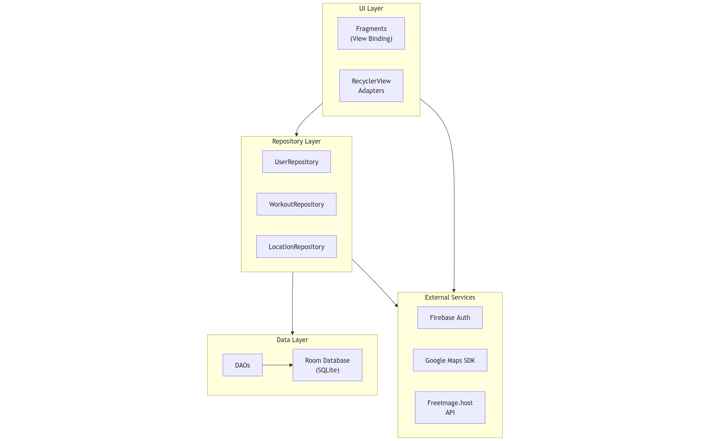
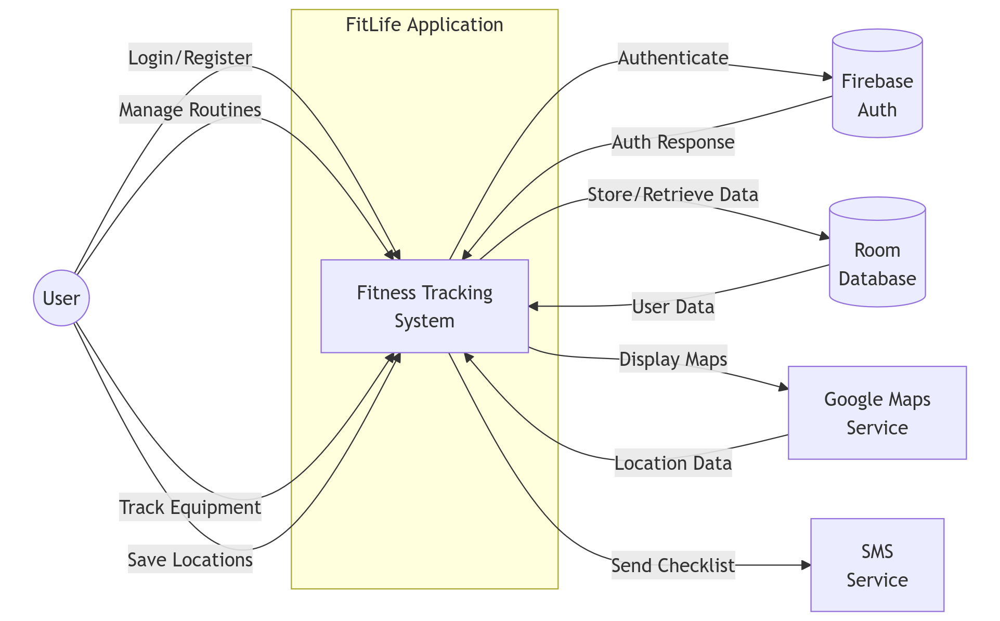
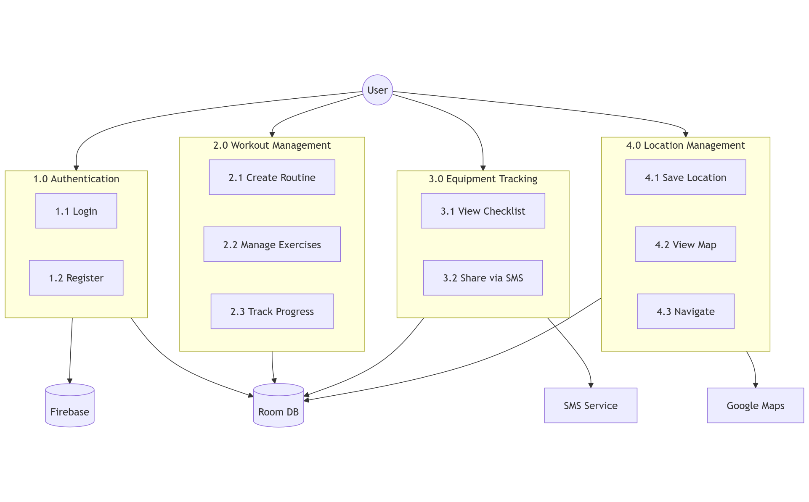
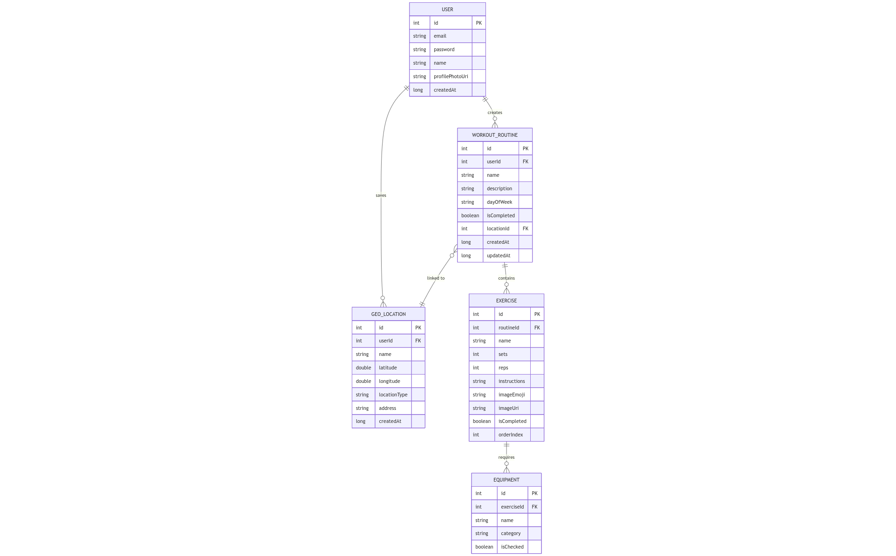
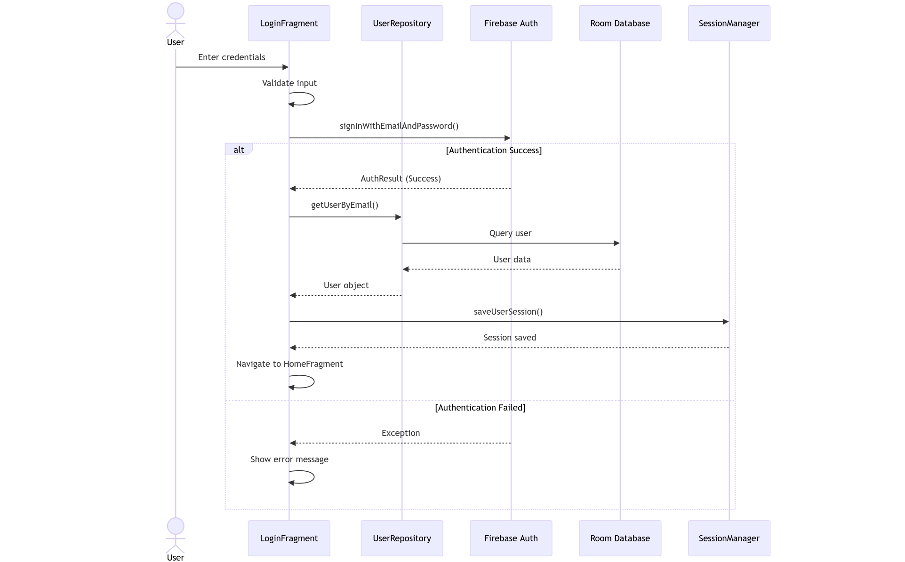
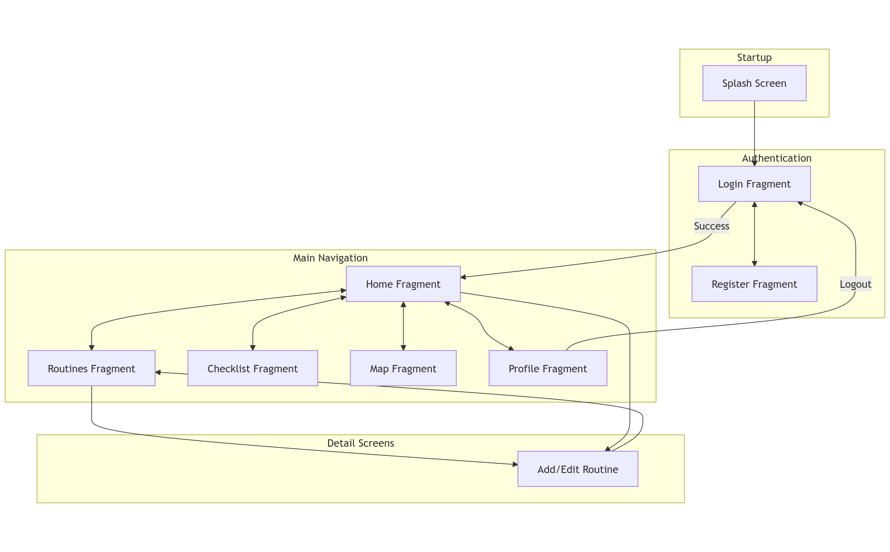
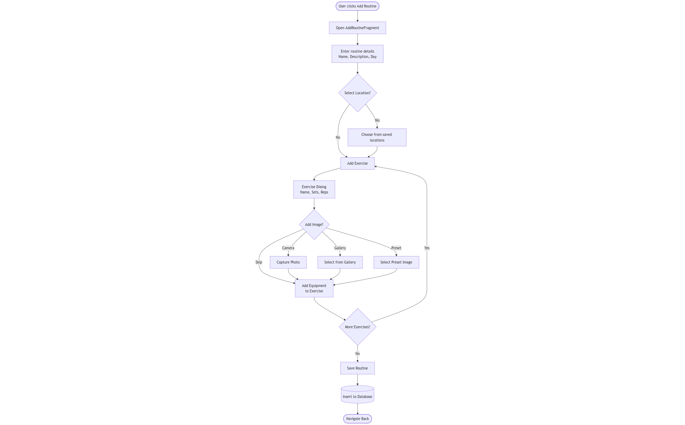
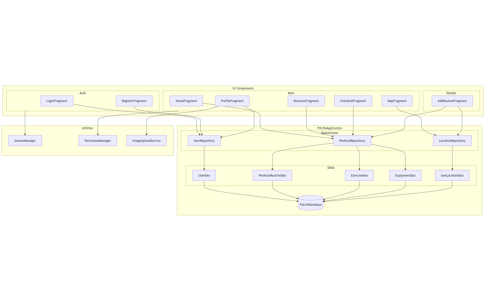
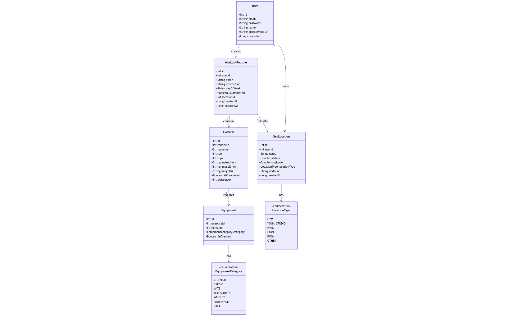

# FitLife

<div style="display: flex; align-items: center;">

  
<div style="text-align: justify; text-justify: inter-word;">
A modern fitness tracking application built with Kotlin for Android. Features workout routine management, equipment checklists with SMS delegation, and gym location geotagging.
</div>
</div>

## Features

-   **Firebase Authentication** - Secure email/password authentication
-   **Workout Routines** - Create and manage weekly workout plans
-   **Equipment Checklist** - Track equipment with SMS delegation
-   **Geotagging** - Save and navigate to your favorite workout locations
-   **Dark Mode** - Beautiful Warm Ink dark theme

## Getting Started

### Prerequisites

-   Android Studio (latest stable version)
-   JDK 17 or higher
-   Android SDK with minimum API level 24

### Installation

1. **Clone the Repository**

    ```bash
    git clone https://github.com/prabinpanta0/FitLife.git
    cd FitLife
    ```

2. **Configure Google Maps API**

    - Navigate to [Google Cloud Console](https://console.cloud.google.com/google/maps-apis)
    - Create a new project or select an existing one
    - Enable "Maps SDK for Android"
    - Create an API key
    - Copy `local.properties.example` to `local.properties`
    - Add your API key:

        ```properties
        MAPS_API_KEY=your_actual_api_key_here
        ```

3. **Configure Firebase**

    - Navigate to [Firebase Console](https://console.firebase.google.com)
    - Create a new project or select an existing one
    - Add an Android app with package name: `com.example.fitlife`
    - Download `google-services.json`
    - Place it in the `app/` directory
    - Enable Email/Password sign-in method in Firebase Authentication

4. **Build and Run**

    ```bash
    ./gradlew assembleDebug
    ```

    Alternatively, open the project in Android Studio and run directly.

## Project Structure

```
app/src/main/
├── java/com/example/fitlife/
│   ├── data/
│   │   ├── dao/              # Room database DAOs
│   │   ├── model/            # Data models
│   │   └── repository/       # Repository pattern
│   ├── ui/
│   │   ├── auth/             # Login and Registration
│   │   ├── checklist/        # Equipment checklist
│   │   ├── home/             # Dashboard
│   │   ├── map/              # Geotagging
│   │   ├── profile/          # User profile
│   │   └── routines/         # Workout routines
│   └── utils/                # Utility classes
└── res/
    ├── layout/               # XML layouts
    ├── navigation/           # Navigation graph
    └── values/               # Colors, strings, themes
```

## Tech Stack

| Component      | Technology         |
| -------------- | ------------------ |
| Language       | Kotlin             |
| Min SDK        | 24 (Android 7.0)   |
| Target SDK     | 34 (Android 14)    |
| Architecture   | Repository Pattern |
| Local Database | Room               |
| Authentication | Firebase Auth      |
| Maps           | Google Maps SDK    |
| UI Framework   | Material Design 3  |

## Architecture Diagrams

### Application Architecture (Layer Diagram)



### Data Flow Diagram (Level 0 - Context)



### Data Flow Diagram (Level 1 - Detailed)



### Entity Relationship Diagram



### User Authentication Flow



### Navigation Flow Diagram



### Workout Creation Process Flow



### Component Diagram



### Class Diagram (Core Models)



## Themes

| Mode  | Name         | Background Color |
| ----- | ------------ | ---------------- |
| Light | Cloud Dancer | `#F0EDE5`        |
| Dark  | Warm Ink     | `#2A2825`        |

## Security

The following files contain sensitive information and must not be committed to version control:

-   `local.properties` - SDK path and API keys
-   `app/google-services.json` - Firebase configuration
-   `.env` or `.env.local` - Environment variables
-   `*.keystore` or `*.jks` files - Signing keys

These files are included in `.gitignore` by default.

## License

This project is for educational purposes.
